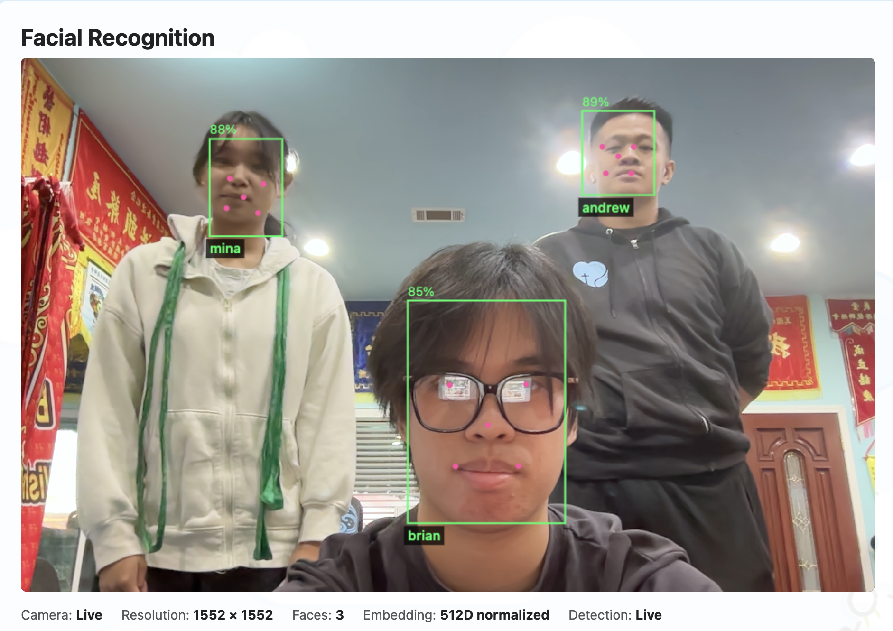

# Facial Recognition Pipeline

Browser captures camera frames, the Python backend processes them, InsightFace generates facial embeddings, and SQLite stores embeddings for persistence and later recognition. Application is packaged using Docker so it can be reproduced consistently. Docker volumes preserve model and the SQLite database.



## Project Structure

```text
app.py                         FastAPI application assembly
index.html                     Browser UI
assets/
  face-tracker.js              Browser-session face tracking
  styles.css                   UI styles
facial_pipeline/
  config.py                    Model and storage configuration
  schemas.py                   API request models
  image_ops.py                 Image decoding, alignment, and normalization
  embeddings.py                Embedding validation and metadata
  embedding_store.py           SQLite facial-embedding persistence
  matching.py                  Cosine matching
  models.py                    Pipeline result types
  service.py                   InsightFace loading and orchestration
  routes.py                    API endpoints under `/api`
docker/Dockerfile              Container image definition
```

## Tools used and why

- **Python**<br>
  Strong for computer vision and machine learning.
- **FastAPI & Uvicorn**<br>
  For APIs and server. Also familiar with it from SCE Wintership.
- **InsightFace (buffalo_l) & ONNX Runtime**<br>
  Identifies facial landmark & converts detected face into numerical embedding. 
- **OpenCV**<br>
  For image processing such as decoding, face alignment, resizing, and encoding.
- **NumPy**<br>
  To represent image and embeds as numerical arrays. Used by calculations such as normalizations and similarity comparisons.
- **SQLite**<br>
  Light local storage for facial data and embeddings.
- **HTML, CSS, and JavaScript**<br>
  To put a camera on webpage. Also normal frontend stuff and functionality.
- **Docker**<br>
  Used docker so the environment can be used on any platform.

## Exposed Endpoints:
- POST /api/model/load <br>
  Downloads and initializes the model.<br>
- POST /api/detect <br>
  Detects and recognizes faces.<br>
- POST /api/enroll <br>
  Saves a detected face under a name.<br>
- DELETE /api/embeddings <br>
  Removes all saved faces.<br>
- DELETE /api/embeddings/{embedding_id} <br>
  Removes one saved embedding.<br>
- GET /api/health <br>
  Verifies that the server is responding.<br>

## Build and Run

Build the image:

```sh
docker build -f docker/Dockerfile -t insightface .
```

Run using:

```sh
docker run --rm -p 8000:8000 \
  -v insightface-models:/opt/insightface \
  -v facial-embeddings:/data \
  insightface
```

Open [http://localhost:8000](http://localhost:8000).

For live updates during development:

```sh
docker run --rm -p 8000:8000 \
  -v "$PWD":/app \
  -v insightface-models:/opt/insightface \
  -v facial-embeddings:/data \
  insightface uvicorn app:app --host 0.0.0.0 --port 8000 --reload
```
